# Сети в Linux. Настройка сетей в Linux на виртуальных машинах.

## Part 1. Инструмент ipcalc
    1.1.1) Адрес сети *192.167.38.54/13*: 

    
    1.1.2) Перевод маски *255.255.255.0* в префиксную и двоичную запись, */15* в обычную и двоичную, *11111111.11111111.11111111.11110000* в обычную и префиксную:
    
        1.1.2.1) Маска *255.255.255.0* в префиксной форме - */24*, в двоичной форме - *11111111.11111111.11111111.00000000*: <br>
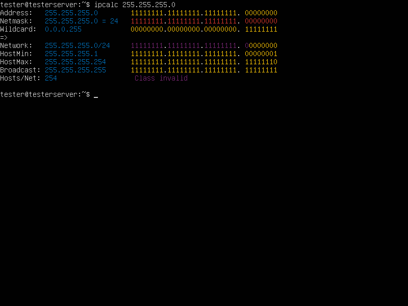
        
        1.1.2.2) Маска *\15* в в обычной форме - *255.254.0.0*, двоичной форме *11111111.11111110.00000000.00000000*: <br>
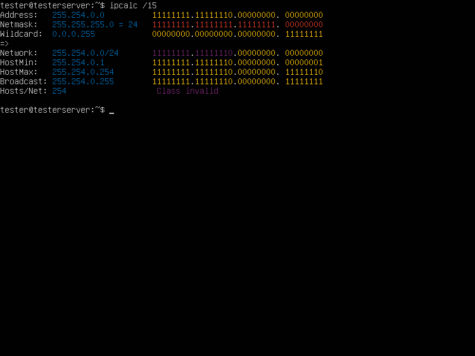 <br>
        
        1.1.2.3) Маска *11111111.11111111.11111111.11110000* в обычной форме - *255.255.255.240*, в префиксной форме - */28*: <br>
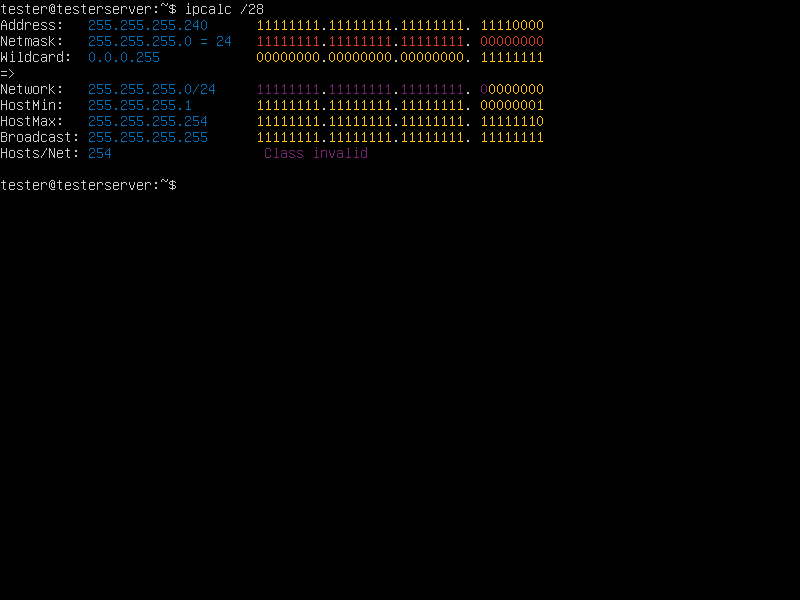 <br>
    
    1.1.3) Минимальный и максимальный хост в сети *12.167.38.4* при масках: */8*, *11111111.11111111.00000000.00000000*, *255.255.254.0* и */4* <br>
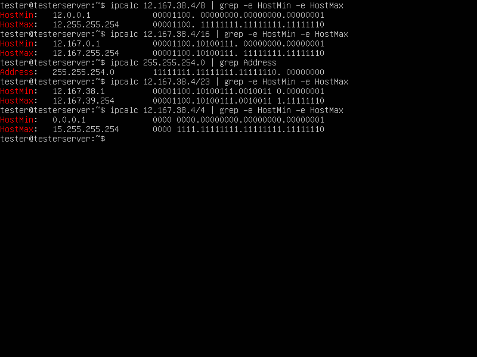 <br>
        
    1.2 localhost. Определение можно ли обращаться к приложению, работающему на localhost, со следующими IP:  
    1. *194.34.23.100* - нет;
    2. *127.0.0.2* - да;
    3. *127.1.0.1* - да;
    4. *128.0.0.1* - нет;
    Диапазон IP-адресов, которые предназначены для создания локальных сетей - *127.0.0.1 - 127.255.255.255* <br>
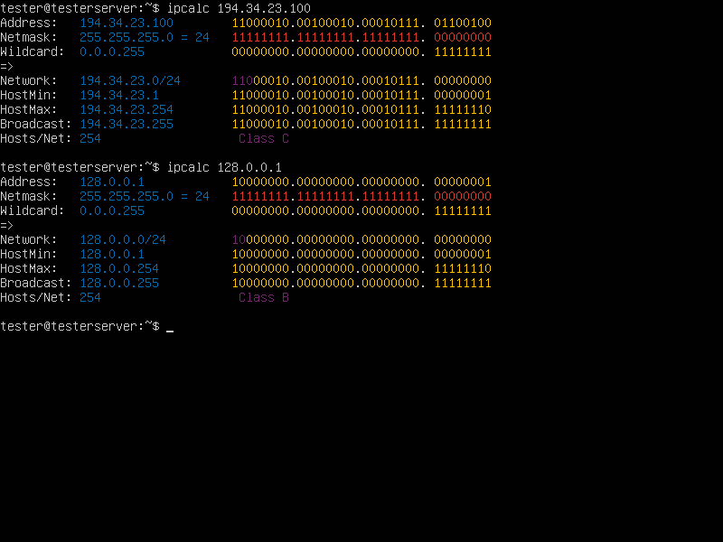<br>
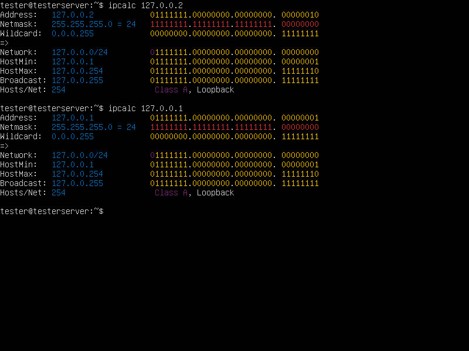<br>
        
        
    1.3. Диапазоны и сегменты сетей
    1.3.1) Какие IP можно использовать в качестве публичного, а какие только в качестве частных: 
    *10.0.0.45* - частная;
    *134.43.0.2* - публичная; 
    *192.168.4.2* - частная; 
    *172.20.250.4* - частная;
    *172.0.2.1* - публичная;
    *192.172.0.1* -публичная;
    *172.68.0.2* - публичная; 
    *172.16.255.255* - частная; 
    *10.10.10.10* - частная;
    *192.169.168.1* - публичная;

    Частные внутренние адреса не маршрутизируются в Интернете и на них нельзя отправить трафик из Интернета, они работают только в пределах локальной сети.
    К частным "серым" адресам относятся IP-адреса из следующих подсетей:
    От 10.0.0.0 до 10.255.255.255 с маской 255.0.0.0 или /8
    От 172.16.0.0 до 172.31.255.255 с маской 255.240.0.0 или /12
    От 192.168.0.0 до 192.168.255.255 с маской 255.255.0.0 или /16
    От 100.64.0.0 до 100.127.255.255 с маской подсети 255.192.0.0 или /10; данная подсеть рекомендована согласно rfc6598 для использования в качестве адресов для CGN (Carrier-Grade NAT)
    
 1.3.2) Какие из перечисленных IP адресов шлюза возможны у сети *10.10.0.0/18*:
 *10.0.0.1* - нет;
 *10.10.0.2* - да;
 *10.10.10.10* - да;
 *10.10.100.1* - нет;
 *10.10.1.255* - да;

## Part 2. Статическая маршрутизация между двумя машинами

    1) Существующие сетевые интерфейсы: 
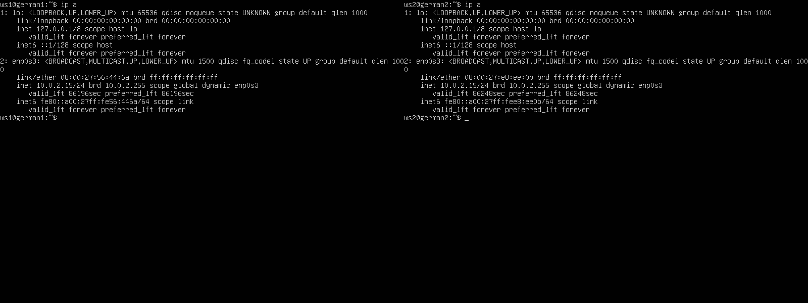<br>

    2) Описание сетевого интерфейса, соответствующий внутренней сети, на обеих машинах и установка следующих адресов и маскок: ws1 - *192.168.100.10*, маска */16*, ws2 - *172.24.116.8*, маска */12*:
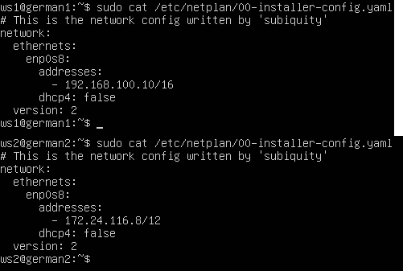<br>
           
    3) Выполнение команды `netplan apply` для перезапуска сервиса сети:
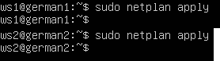<br>

    4) Добавление статического маршрута от одной машины до другой и обратно при помощи команды вида `ip r add`:
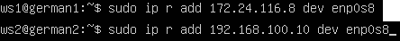<br>
    
    5) Пингование соединение между машинами:
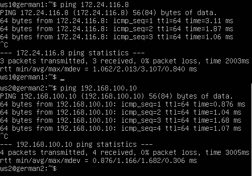<br>

    6) Добавление статического маршрута от одной машины до другой с помощью файла *etc/netplan/00-installer-config.yaml*:
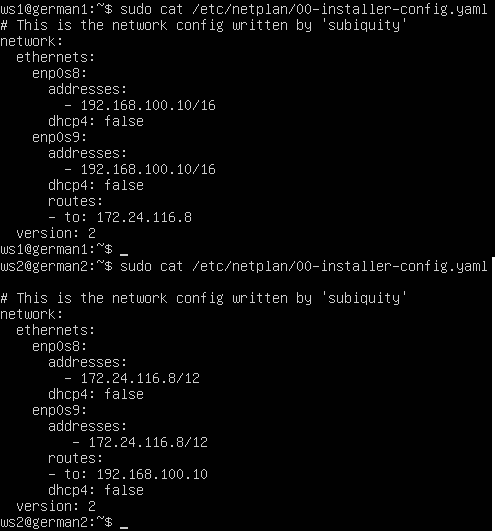<br>
               
    7) Пингование соединения между машинами:
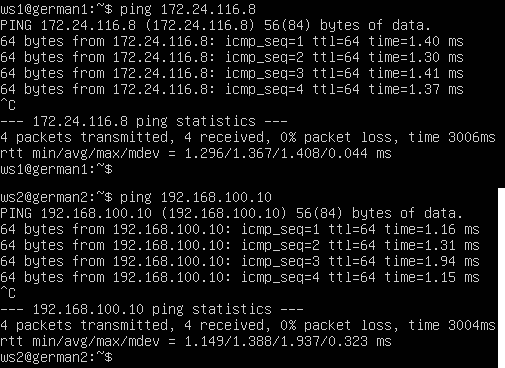<br>


## Part 3. Утилита **iperf3**

    3.1) Перевод : 8 Mbps в MB/s, 100 MB/s в Kbps, 1 Gbps в Mbps:
    8 Mbps = 1 MB/s;
    100 MB/s = 819200 Kbps;
    1 Gbps = 1024 Mbps;
    
    3.2) Измерение скорости соединения между ws1 и ws2 с помощью утилиты **iperf3**:
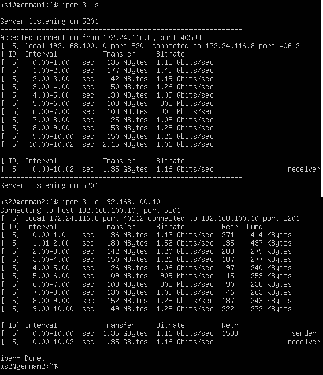<br>

## Part 4. Сетевой экран. Утилита **iptables**

    4.1) Создание файла */etc/firewall.sh*, имитирующий фаерволл, на ws1 и ws2:
    Добавление в файл подряд следующих правил:
    1) На ws1 применение стратегии, когда в начале пишется запрещающее правило, а в конце пишется разрешающее правило (это касается пунктов 4 и 5).
    2) На ws2 применение стратегии, когда в начале пишется разрешающее правило, а в конце пишется запрещающее правило (это касается пунктов 4 и 5).
    3) Открытие на машинах доступ для порта 22 (ssh) и порта 80 (http).
    4) Запрещение *echo reply* (машина не должна «пинговаться», т.е. должна быть блокировка на OUTPUT).
    5) Разрешение *echo reply* (машина должна «пинговаться»).
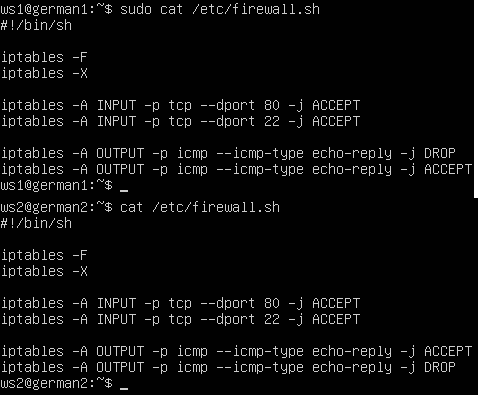<br>
1. iptables -F: Очищает все правила в цепочках (chains) iptables.

2. iptables -X: Удаляет все пользовательские цепочки iptables.

3. iptables -A INPUT -p tcp --dport 80 -j ACCEPT: Разрешает входящий TCP трафик на порт 80.

4. iptables -A INPUT -p tcp --dport 22 -j ACCEPT: Разрешает входящий TCP трафик на порт 22 (SSH).

5. iptables -A OUTPUT -p icmp --icmp-type echo-reply -j ACCEPT: Разрешает исходящие ICMP эхо-ответы.

6. iptables -A OUTPUT -p icmp --icmp-type echo-reply -j DROP: Отбрасывает все исходящие ICMP эхо-ответы.

    4.2)Запуск файлы на обеих машинах командами `chmod +x /etc/firewall.sh` и `/etc/firewall.sh`:
<br>

    Разница между стратегиями:
    - ws1 (запрещающее правило в начале) будет в первую очередь блокировать исходящий трафик, в то время как разрешающее правило позволит пропускать соответствующий трафик. Важно определить порядок правил таким образом, чтобы запрещающее правило имело приоритет.
    - ws2 (разрешающее правило в начале) будет в первую очередь разрешать исходящий трафик, а затем запрещающее правило будет блокировать трафик, который не был разрешен первоначально. Здесь важно, чтобы разрешающее правило имело приоритет перед запрещающим правилом.
    
    4.3) Командой **ping** нахождение машины, которая не «пингуется», после чего утилитой **nmap** показ, что хост машины запущен.
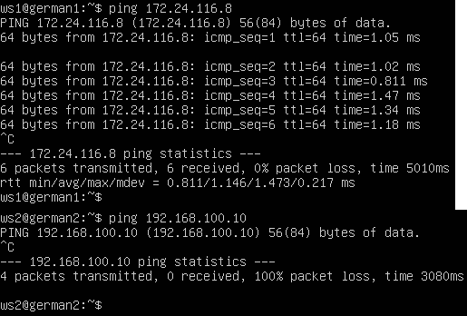<br>
    *Проверка: в выводе nmap должно быть сказано: `Host is up`*.<br>
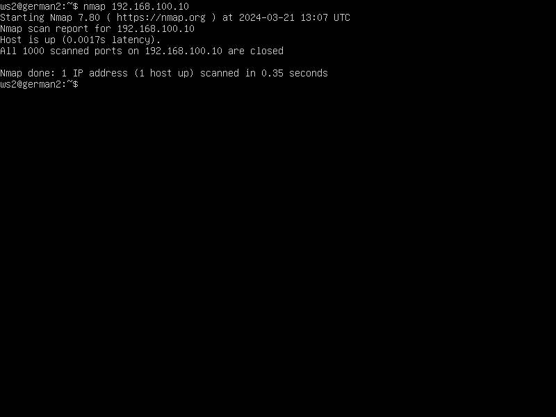<br>

## Part 5. Статическая маршрутизация сети
    5.1. Настройка адресов машин
    
    Настройка конфигурации машин в *etc/netplan/00-installer-config.yaml*:
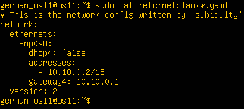<br>
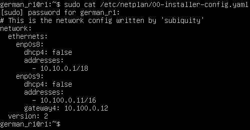<br>
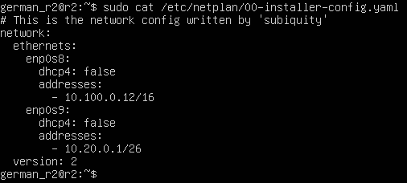<br>
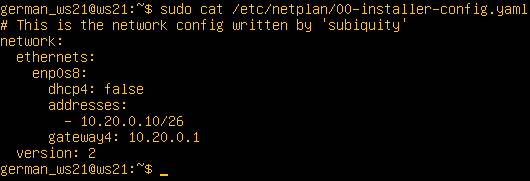<br>
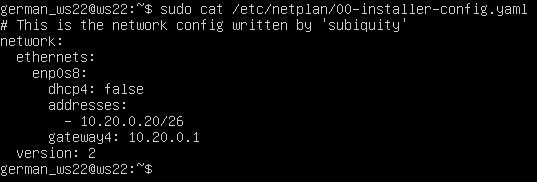<br>
           
    Перезапуск сервиса сети. Проверка командой `ip -4 a`, что адрес машины задан верно:
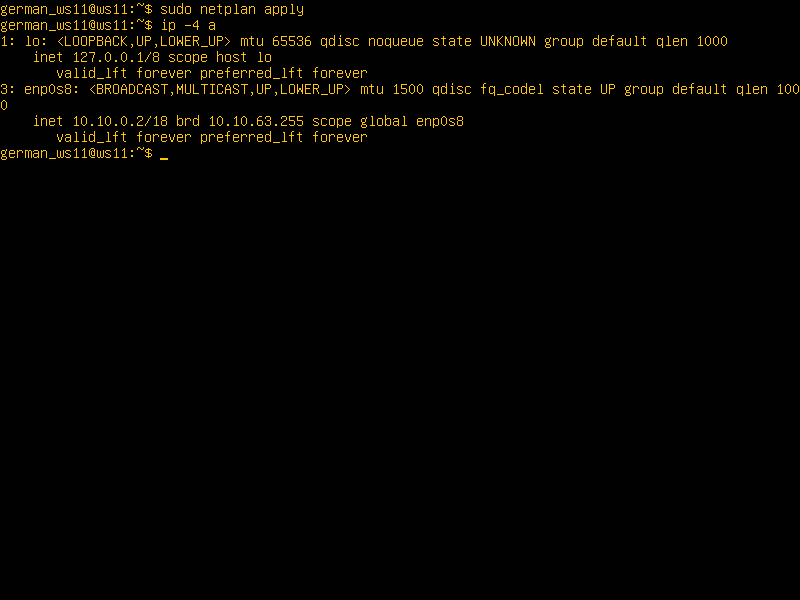<br>
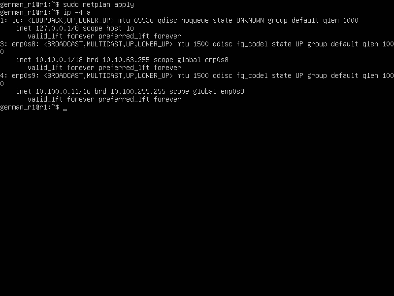<br>
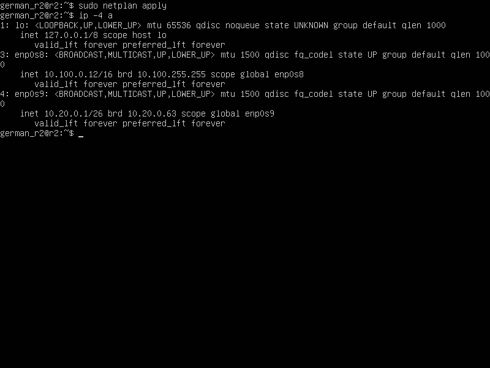<br>
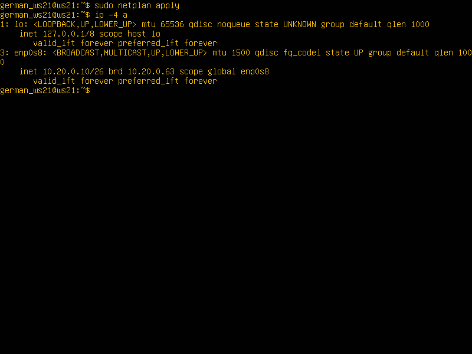<br>
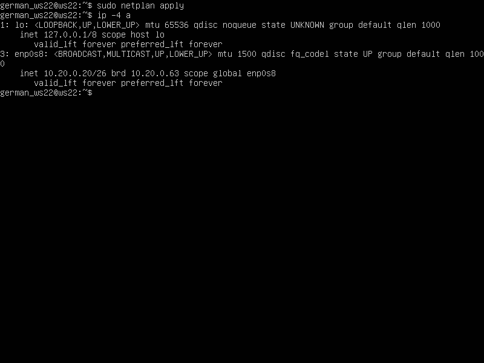<br>
           
    Проверка пинг ws22 с ws21 и r1 с ws11:
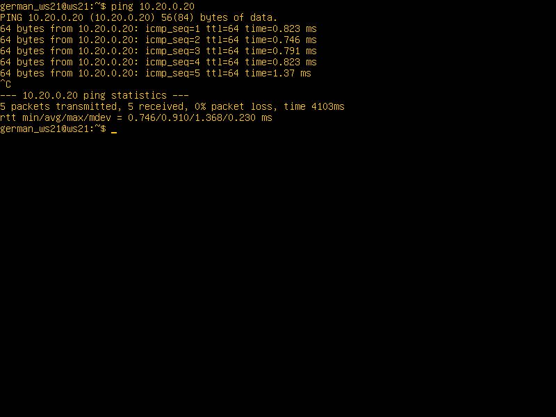<br>
<br>
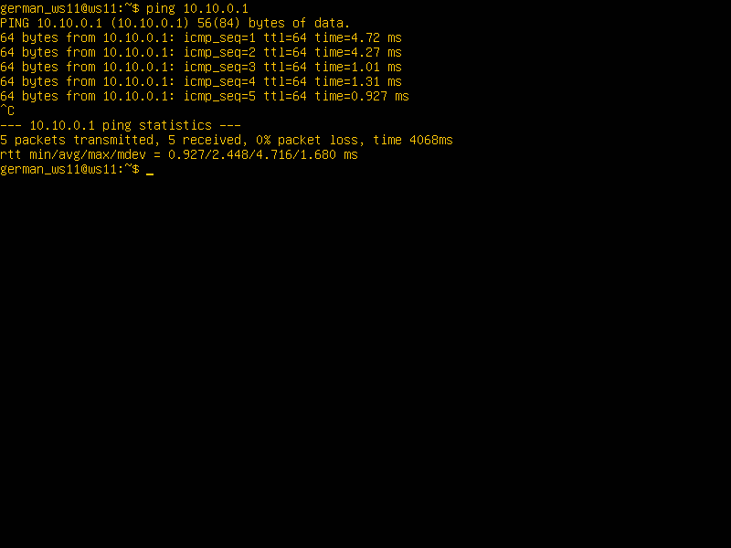<br>
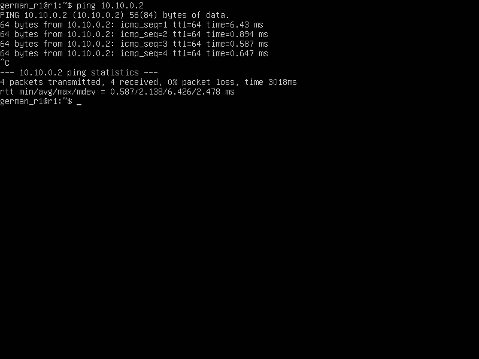<br>
           
    5.2. Включение переадресации IP-адресов.
    Включения переадресации IP, выполни команду на роутерах `sysctl -w net.ipv4.ip_forward=1`:
<br>


    Добавление в файл */etc/sysctl.conf* следующей строки `net.ipv4.ip_forward = 1`:
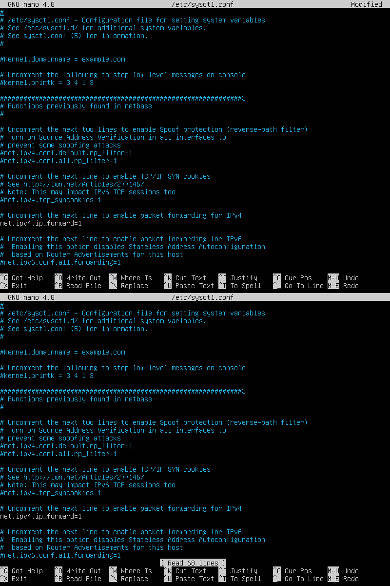<br>

    5.3. Установка маршрута по-умолчанию
    
    Пример вывода команды `ip r` после добавления шлюза:
    ```
    default via 10.10.0.1 dev eth0
    10.10.0.0/18 dev eth0 proto kernel scope link src 10.10.0.2
    ```
    
    Настройка маршрута по-умолчанию (шлюз) для рабочих станций. Добавь `default` перед IP роутера в файле конфигураций и вызов `ip r` и показ, что добавился маршрут в таблицу маршрутизации:
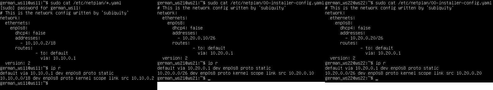<br>


    Пингование с ws11 роутер r2 и показ на r2, что пинг доходит с использованием команды `tcpdump -tn -i eth0`:
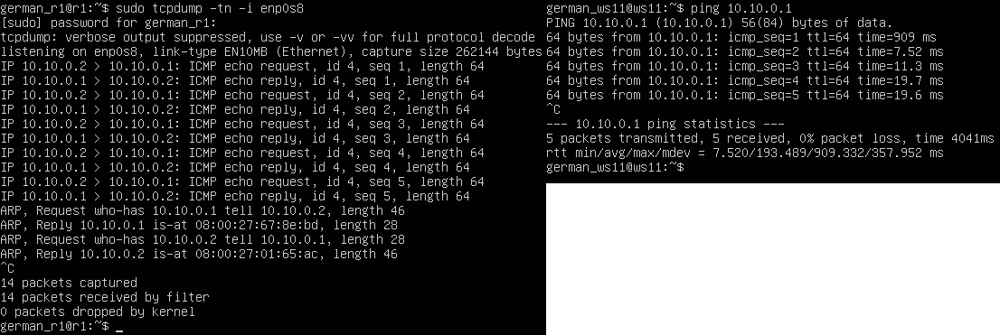<br>
           
           
    5.4. Добавление статических маршрутов
    Добавление в роутеры r1 и r2 статических маршрутов в файле конфигураций. 
    Пример для r1 маршрута в сетку 10.20.0.0/26:
    ```shell
    # Добавь в конец описания сетевого интерфейса eth1:
    - to: 10.20.0.0
      via: 10.100.0.12
    ``` 
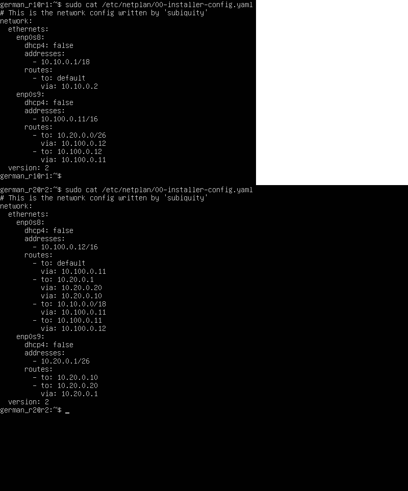<br>

    Вызов `ip r` и показ таблицы с маршрутами на обоих роутерах:
    Пример таблицы на r1:
    ```
    10.100.0.0/16 dev eth1 proto kernel scope link src 10.100.0.11
    10.20.0.0/26 via 10.100.0.12 dev eth1
    10.10.0.0/18 dev eth0 proto kernel scope link src 10.10.0.1
    ```
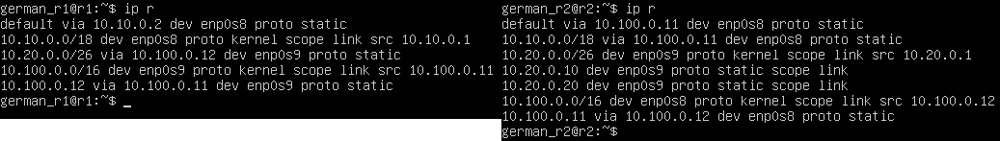<br>
    
    Запуск команды `ip r list 10.10.0.0/[маска сети]` и `ip r list 0.0.0.0/0` на ws11:
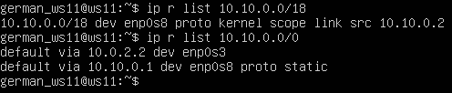<br>

    Если адрес 10.10.0.0/[маска сети] соответствует специфической сети или подсети, система может использовать более специфический маршрут для доставки пакетов к этому адресу, чем маршрут по умолчанию 0.0.0.0/0. Маршрут по умолчанию обычно используется для доставки всех сетевых пакетов, не попадающих в более специфические маршруты.

    5.5. Построение списка маршрутизаторов
    Пример вывода утилиты **traceroute** после добавления шлюза:
    ```
    1 10.10.0.1 0 ms 1 ms 0 ms
    2 10.100.0.12 1 ms 0 ms 1 ms
    3 10.20.0.10 12 ms 1 ms 3 ms
    ```
    Запуск на r1 команды дампа `tcpdump -tnv -i eth0`:
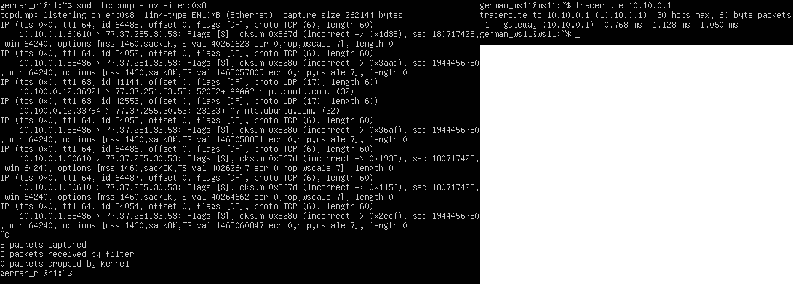<br>
   
    5.6. Использование протокола **ICMP** при маршрутизации
    Запуск на r1 перехват сетевого трафика, проходящего через eth0 с помощью команды `tcpdump -n -i eth0 icmp` и пингование с ws11 несуществующий IP с помощью команды `ping -c 1 10.30.0.111`:
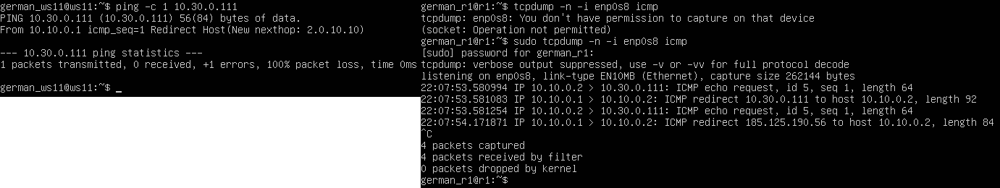<br>

## Part 6. Динамическая настройка IP с помощью **DHCP**

    6.1) Установка адреса маршрутизатора по-умолчанию, DNS-сервер и адрес внутренней сети. Пример файла для r2:
    ```shell
    subnet 10.100.0.0 netmask 255.255.0.0 {}

    subnet 10.20.0.0 netmask 255.255.255.192
    {
        range 10.20.0.2 10.20.0.50;
        option routers 10.20.0.1;
        option domain-name-servers 10.20.0.1;
    }
    ```
<br>

    6.2) В файле *resolv.conf* прописание `nameserver 8.8.8.8`:
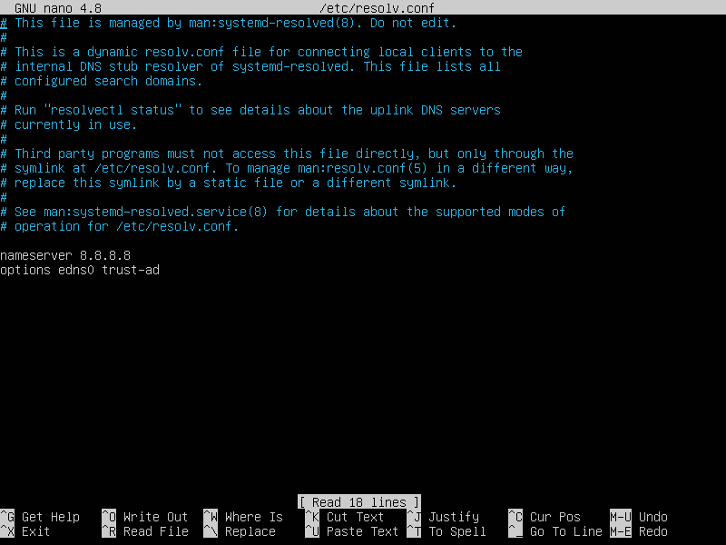<br>

    Перезагрузка службы **DHCP** командой `systemctl restart isc-dhcp-server`: 
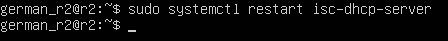<br>
        
    Перезагрузка машины ws21 при помощи `reboot` и через `ip a` показ, что она получила адрес:
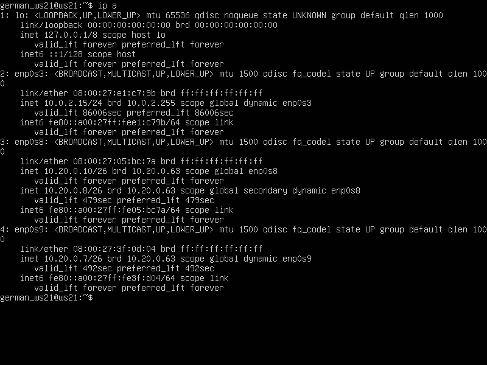<br>
        
    Пинговагние ws22 с ws21: <br>
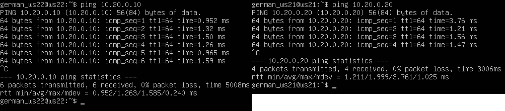<br>

    Установка MAC адреса у ws11, для этого в *etc/netplan/00-installer-config.yaml* добавление строки: `macaddress: 10:10:10:10:10:BA`, `dhcp4: true`: 
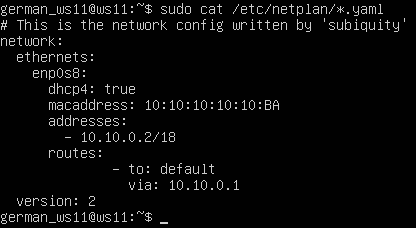<br>

    Настройка r1 аналогично r2, с выдачой адресов с жесткой привязкой к MAC-адресу (ws11): 
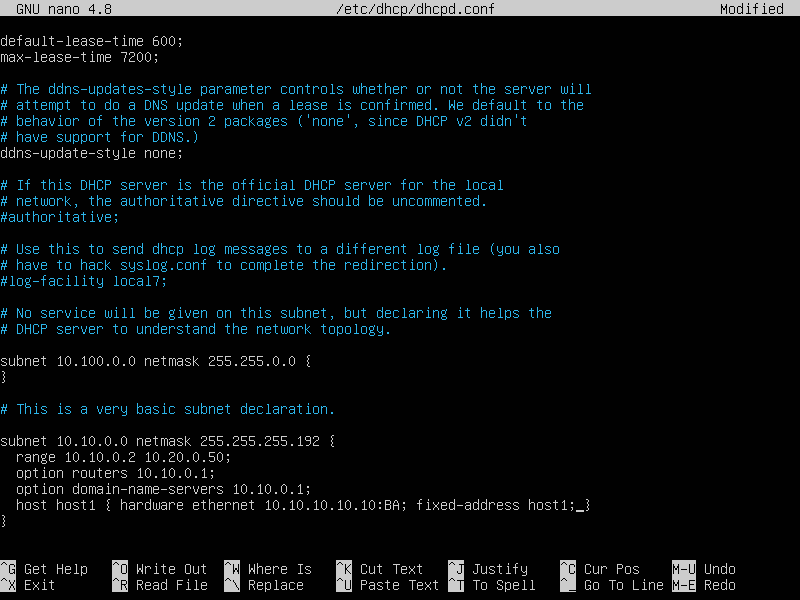<br>
        
        Restart system:
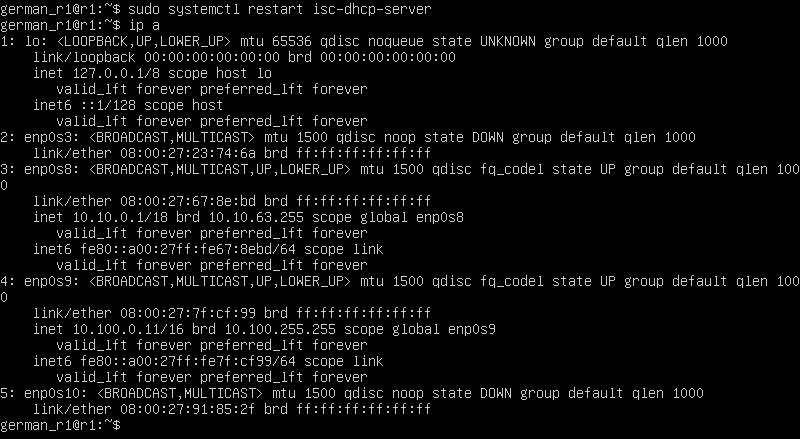<br>
        
    Запрос с ws21 обновление ip адреса: 
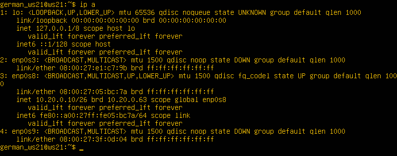<br>
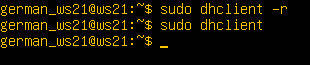<br>
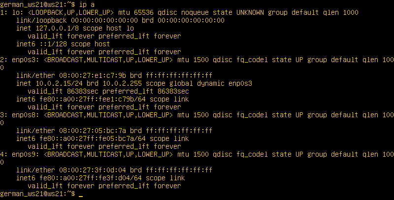<br>


## Part 7. **NAT**

    В файле */etc/apache2/ports.conf* на ws22 и r1 изменение строки `Listen 80` на `Listen 0.0.0.0:80`, то есть установка сервера Apache2 общедоступным:
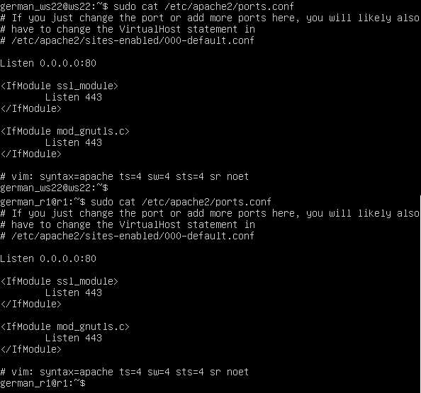<br>

    Запуск веб-сервера Apache командой `service apache2 start` на ws22 и r1:
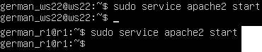<br>
      
      Ping r1 с ws22:<br>
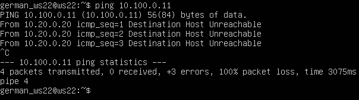<br>
      
    Добавление фаервола, созданный по аналогии с фаерволом из Части 4, на r2 со следующие правила:
    1) Удаление правил в таблице filter - `iptables -F`;
    2) Удаление правил в таблице "NAT" - `iptables -F -t nat`;
    3) Отбрасывать все маршрутизируемые пакеты - `iptables --policy FORWARD DROP`;
    4) Разрешить маршрутизацию всех пакетов протокола **ICMP**.
    5) Включение **SNAT**, а именно маскирование всех локальных ip из локальной сети, находящейся за r2 (по обозначениям из Части 5 - сеть 10.20.0.0).
    6) Включение **DNAT** на 8080 порт машины r2 и добавить к веб-серверу Apache, запущенному на ws22, доступ извне сети. 
<br>
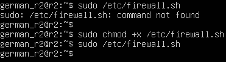<br>
            
    1. iptables -A INPUT -p tcp --dport 22 -j ACCEPT: Разрешает входящий TCP-трафик на порт 22 (SSH).

    2. iptables -A INPUT -p tcp --dport 80 -j ACCEPT: Разрешает входящий TCP-трафик на порт 80 (HTTP).

    3. iptables -F: Очищает все правила в цепочке FILTER (стандартная цепь для фильтрации пакетов).

    4. iptables -F -t nat: Очищает все правила в цепочке NAT (цепь для сетевой адресной трансляции).

    5. iptables -A FORWARD -p icmp - j ACCEPT  iptables --policy FORWARD DROP: Эта команда разрешает проход ICMP пакетов и устанавливает политику DROP для цепочки FORWARD.

    6. iptables -A FORWARD -p tcp - j ACCEPT:  Данная команда разрешает проход TCP пакетов через сервер.

    7. iptables -t nat -A POSTROUTING -o enpos8 -s 10.20.0.0/26 -p tcp -j SNAT --to-source 10.100.0.12: Настраивает перенаправление исходящего TCP-трафика для сети 10.20.0.0/26 через интерфейс enpos8 с изменением исходного IP на 10.100.0.12.

    8. iptables -t nat -A PREROUTING -D tcp -d 10.20.0.1 --dport 8080 -j DNAT --to-destination 10.20.0.20:80: Эта команда настраивает правило маршрутизации для входящего TCP трафика на порту 8080 к IP 10.20.0.1, чтобы перенаправить его на IP 10.20.0.20 на порт 80.
            
    Проверка соединения между ws22 и r1 командой `ping`:
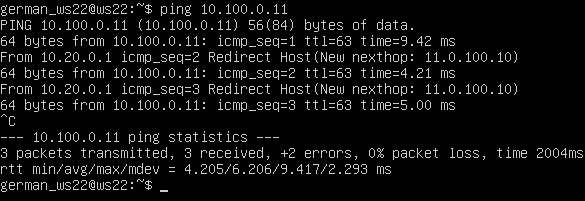<br>

    Проверка соединения по TCP для **SNAT**: для этого с ws22 подключиться к серверу Apache на r1 командой:
    `telnet [адрес] [порт]`
    
    Проверка соединение по TCP для **DNAT**: для этого с r1 подключиться к серверу Apache на ws22 командой `telnet` (обращаться по адресу r2 и порту 8080).
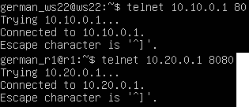<br>

## Part 8. Дополнительно. Знакомство с **SSH Tunnels**

    Запуск на r2 фаервол с правилами из Части 7:
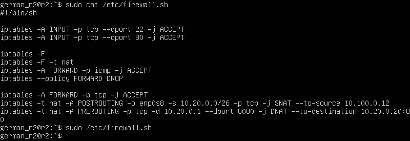<br>
1. iptables -A INPUT -p tcp --dport 22 -j ACCEPT: Эта команда добавляет правило в цепочку INPUT для разрешения входящих TCP пакетов на порт 22 (SSH).

2. iptables -A INPUT -p tcp --dport 80 -j ACCEPT: Эта команда добавляет правило в цепочку INPUT для разрешения входящих TCP пакетов на порт 80 (HTTP).

3. iptables -F: Эта команда очищает все правила в цепочках INPUT, OUTPUT и FORWARD (стандартные цепочки iptables).

4. iptables -F -t nat: Эта команда очищает все правила в цепочках NAT (цепочки для преобразования адресов).

5. iptables -A FORWARD -p icmp -j ACCEPT: Эта команда добавляет правило в цепочку FORWARD для разрешения ICMP пакетов (пакетов контроля сообщений интернет-протоколов).

6. iptables --policy FORWARD DROP: Эта команда устанавливает политику по умолчанию для цепочки FORWARD на DROP, что означает отбрасывание всех пакетов, если для них не существует соответствующего разрешающего правила.

7. iptables -A FORWARD -p tcp -j ACCEPT: Эта команда добавляет правило для разрешения всего TCP трафика в цепочке FORWARD.

8. iptables -t nat -A POSTROUTING -o enp0s8 -s 10.20.0.0/26 -p tcp -j SNAT --to-source 10.100.0.12: Эта команда применяет операцию Source NAT (SNAT) к исходящему TCP трафику с IP адресов в диапазоне 10.20.0.0/26 через интерфейс enp0s8, заменяя IP адрес источника на 10.100.0.12.

9. iptables -t nat -A PREROUTING -p tcp --dport 8080 -d 10.20.0.1 -j DNAT --to-destination 10.20.0.20:80: Эта команда применяет операцию Destination NAT (DNAT) к входящему TCP трафику на порт 8080 с IP адреса 10.20.0.1, перенаправляя его на IP адрес 10.20.0.20 и порт 80.

    Запуск веб-сервера **Apache** на ws22 только на localhost (то есть в файле */etc/apache2/ports.conf* измени строку `Listen 80` на `Listen localhost:80`):
<br>
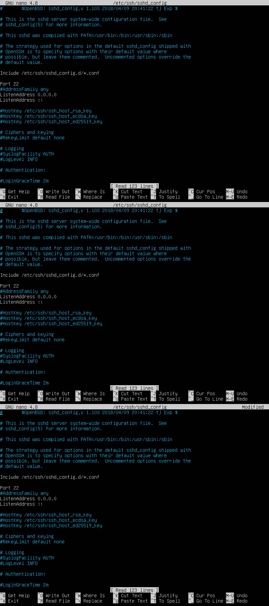<br>
    
    Использование *Local TCP forwarding* с ws21 до ws22, чтобы получить доступ к веб-серверу на ws22 с ws21:<br>
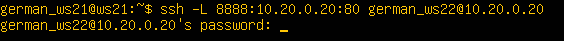<br>
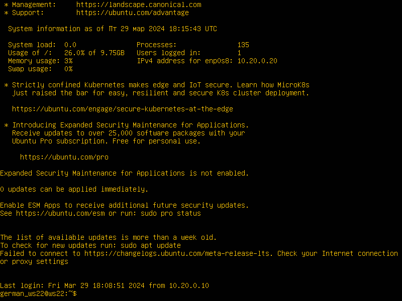<br>
    Использование *Remote TCP forwarding* c ws11 до ws22, чтобы получить доступ к веб-серверу на ws22 с ws11.
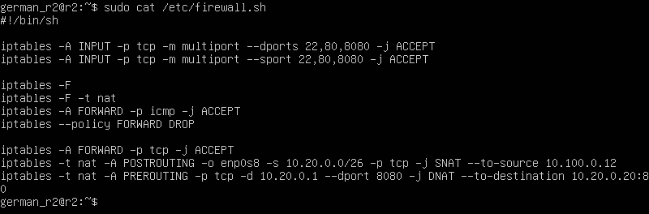<br>
1. iptables -A INPUT -p tcp -m multiport --dports 22,80,8080 -j ACCEPT: Это правило позволяет входящий TCP-трафик на портах 22, 80 и 8080.

2. iptables -A INPUT -p tcp -m multiport --sport 22,80,8080 -j ACCEPT: Это правило позволяет входящий TCP-трафик с портов 22, 80 и 8080.

3. iptables -F: Эта команда очищает все текущие правила iptables в таблице filter, фактически удаляя все правила.

4. iptables -F -t nat: Эта команда очищает все текущие правила iptables в таблице NAT.

5. iptables -A FORWARD -p icmp -j ACCEPT: Это правило позволяет ICMP-трафику (ping) проходить через брандмауэр в цепочке FORWARD.

6. iptables --policy FORWARD DROP: Это устанавливает политику по умолчанию для цепи FORWARD на отклонение любых пакетов, которые не соответствуют конкретному правилу.

7. iptables -A FORWARD -p tсp -j ACCEPT:  Она пытается разрешить прохождение TCP-трафика через брандмауэр в цепочке FORWARD.

8. iptables -t nat -A POSTROUTING -o enpos8 -s 10.20.0.0/26 -p tcp -j SNAT --to-source 10.100.0.12: Это правило используется для исходной трансляции сетевого адреса (SNAT), чтобы изменить исходный IP-адрес исходящего TCP-трафика из подсети 10.20.0.0/26 на 10.100.0.12, когда он проходит через интерфейс enpos8.

9. iptables -t nat -A PREROUTING -p tcp -d 10.20.0.1 --dport 8080 -j DNAT --to-destination 10.20.0.20:80: Это правило используется для преобразования адреса (DNAT) назначения, чтобы перенаправить входящий TCP-трафик с IP-адресом назначения 10.20.0.1 и портом 8080 на адрес 10.20.0.20 на порт 80.
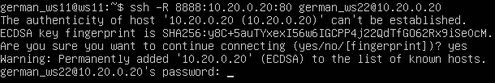<br>
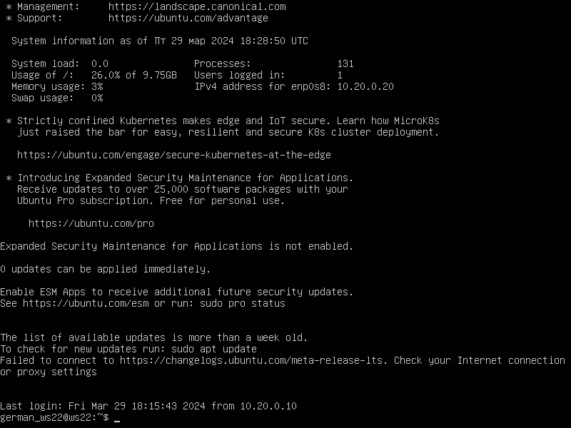<br>
    Для проверки, сработало ли подключение в обоих предыдущих пунктах, перейди во второй терминал (например, клавишами Alt + F2) и выполни команду:
    `telnet 127.0.0.1 [локальный порт]`
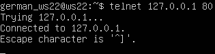<br>