# Simple Docker

## Part 1. Готовый докер

##### Загрузка официального докер-образ с **nginx** и выгрузка его при помощи `docker pull`.  
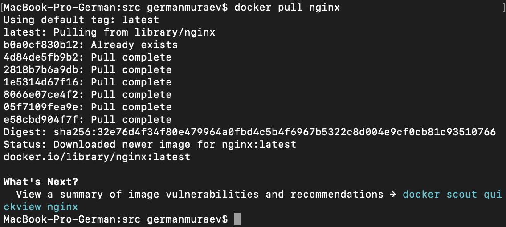  

##### Проверка наличия докер-образа через `docker images`.
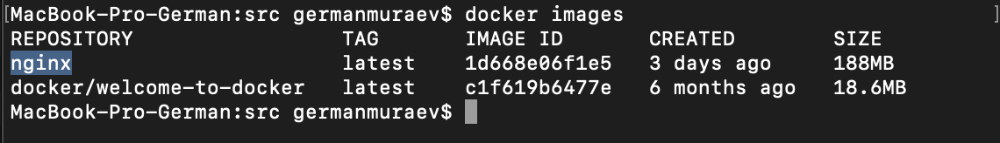

##### Запусти докер-образ через `docker run -d [image_id|repository]`.  
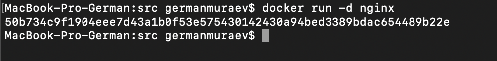  

Флаг -d — это сокращение для --detach. Эта команда запускает контейнер в фоновом режиме. Это позволяет использовать терминал, из которого запущен контейнер, для выполнения других команд во время работы контейнера.

##### Проверка, что образ запустился через `docker ps`.  
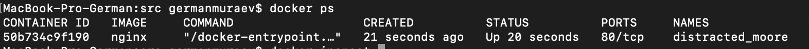  

##### Просмотр информации о контейнере через `docker inspect [container_id|container_name]`.  
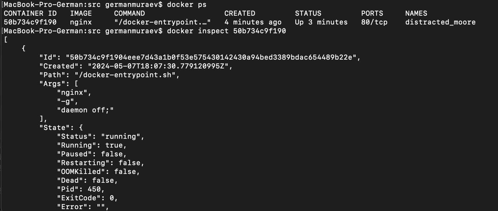  

##### Размер контейнера:  
  

##### Список замапленных портов:  
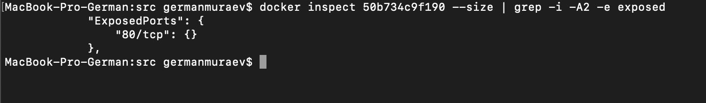  

##### ip контейнера:  
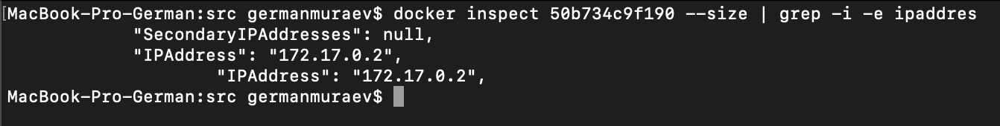  

##### Остановка докер образа через  `docker stop [container_id|container_name]`.  
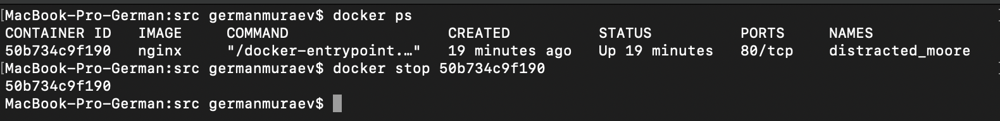  

##### Проверка, что образ остановился через `docker ps`.  
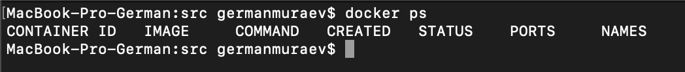  

##### Запуск докера с портами 80 и 443 в контейнере, замапленными на такие же порты на локальной машине, через команду *run*.  
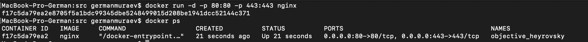  

- docker run: команда для запуска контейнера.
- -p 80:80: опция для прокидывания порта контейнера на хост-систему. В этом случае порт 80 контейнера будет доступен по порту 80 хост-системы.
- -p 443:443: аналогично предыдущей опции, но для порта 443, который обычно используется для HTTPS соединений.
- nginx: имя образа, который будет использован для запуска контейнера.

С помощью этой команды мы запускаем контейнер с веб-сервером Nginx в фоновом режиме и прокидываем порты 80 и 443 с контейнера на хост-систему, чтобы можно было обращаться к веб-серверу через HTTP и HTTPS соответственно.

##### Проверка, что в браузере по адресу *localhost:80* доступна стартовая страница **nginx**.  
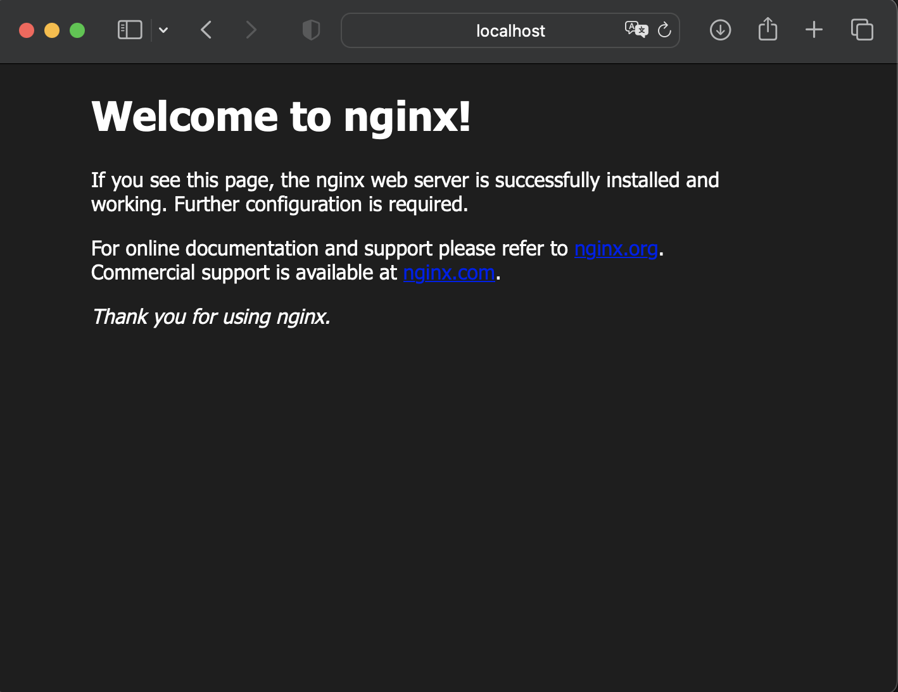  

##### Перезапуск докер контейнера через `docker restart [container_id|container_name]`.  
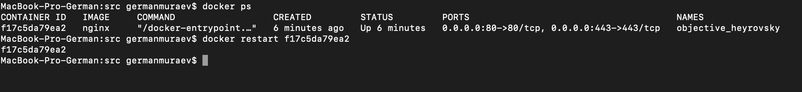  

##### Проверка, что контейнер запустился.  
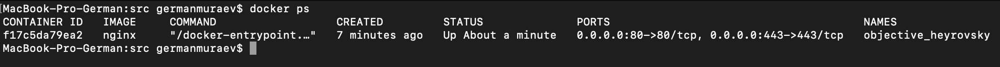  

## Part 2. Операции с контейнером

##### Прочтение конфигурационного файла *nginx.conf* внутри докер контейнера через команду *exec*.  
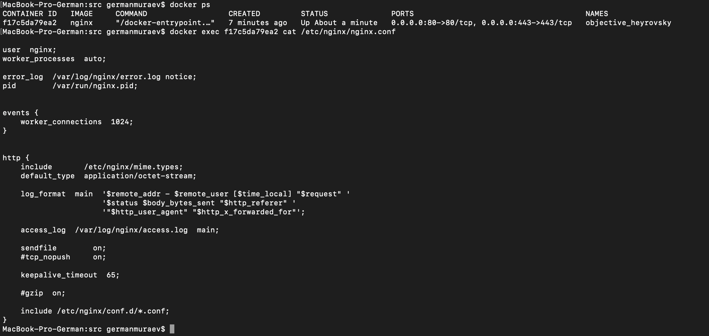  
- docker exec: команда для выполнения команд в контейнере

##### Создание на локальной машине файл *nginx.conf*.  
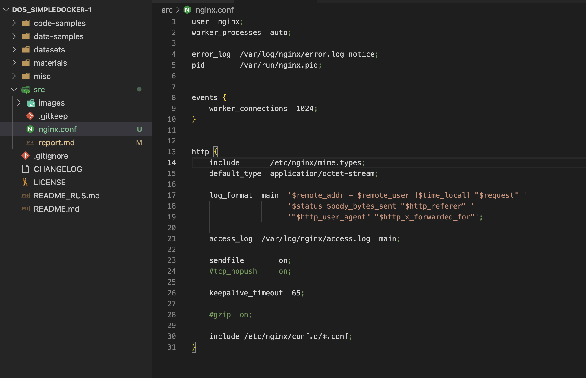  

##### Настройка в нем по пути */status* отдачу страницы статуса сервера **nginx**.
Модуль ngx_http_status_module предоставляет доступ к информации о состоянии сервера.
Для активации закоментил    # include /etc/nginx/conf.d/*.conf;  
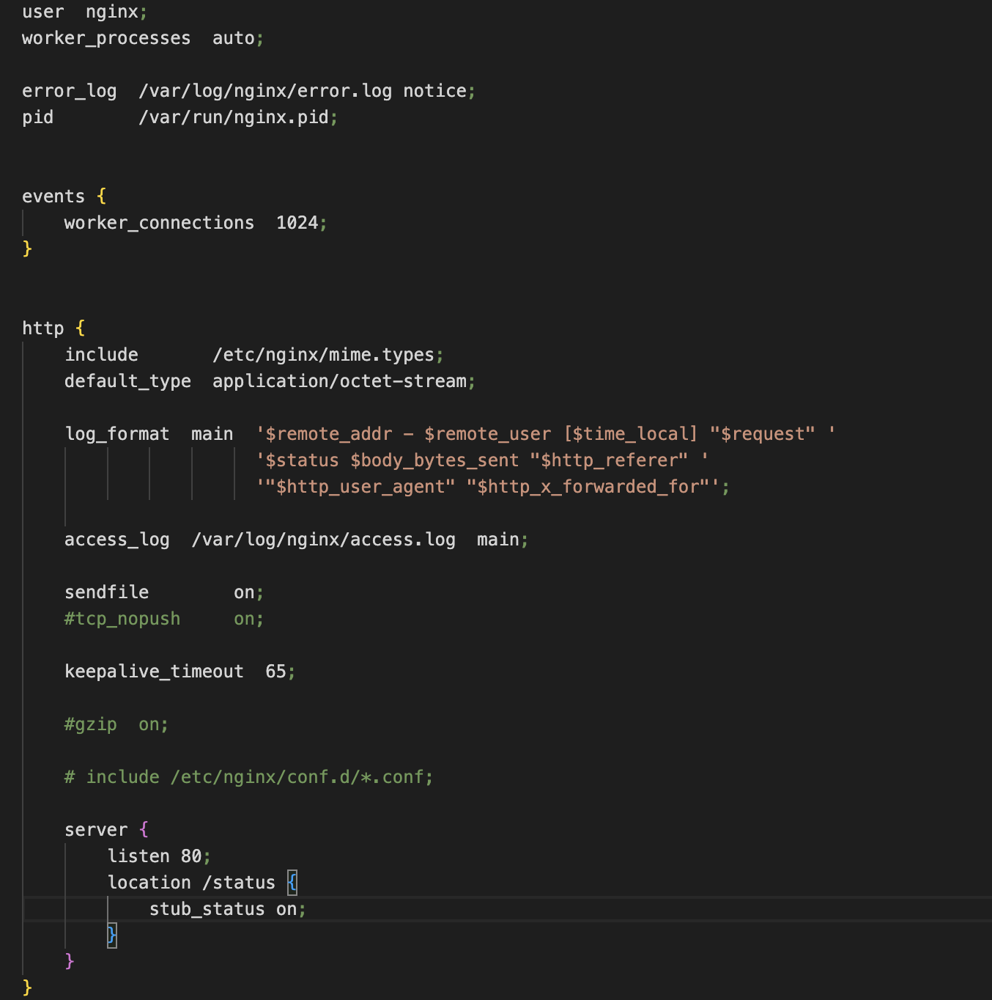  

##### Скопируем созданный файл *nginx.conf* внутрь докер-образа через команду `docker cp` (docker cp nginx.conf objective_heyrovsky:etc/nginx/) и перезапустим **nginx** внутри докер-образа через команду *exec* (docker exec objective_heyrovsky nginx -s reload).  
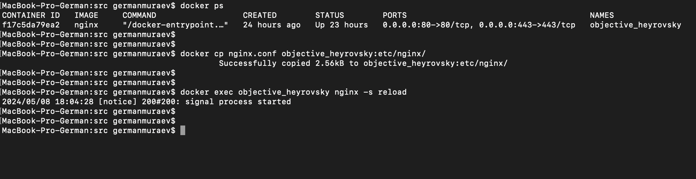  
Флаг -s reload используется для отправки сигнала перезагрузки Nginx серверу, который запущен внутри контейнера. 

##### Проверка, что по адресу *localhost:80/status* отдается страничка со статусом сервера **nginx**.  
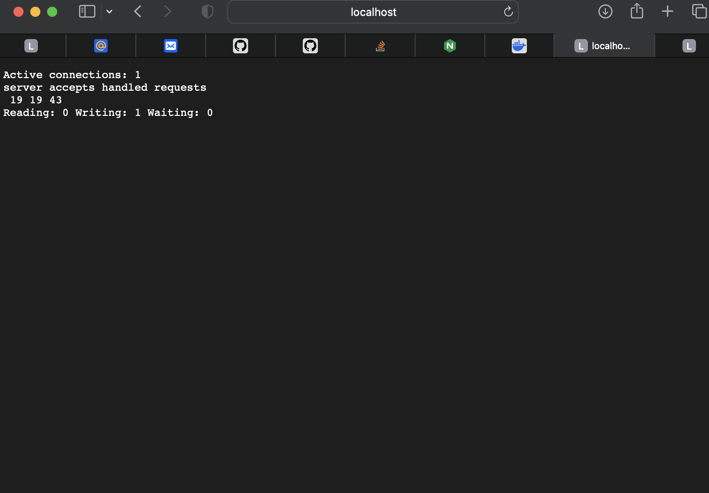  

##### Экспортируем контейнер в файл *container.tar* через команду *export*.  
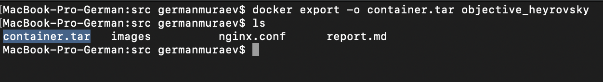  

##### Остановка контейнера.  
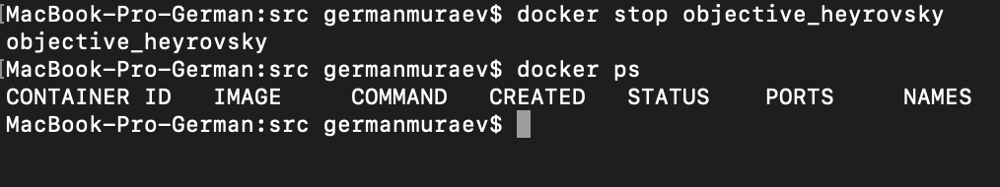  

##### Удаление образ через `docker rmi [image_id|repository]`, не удаляя перед этим контейнеры и после этого удаление остановленного контейнера.  
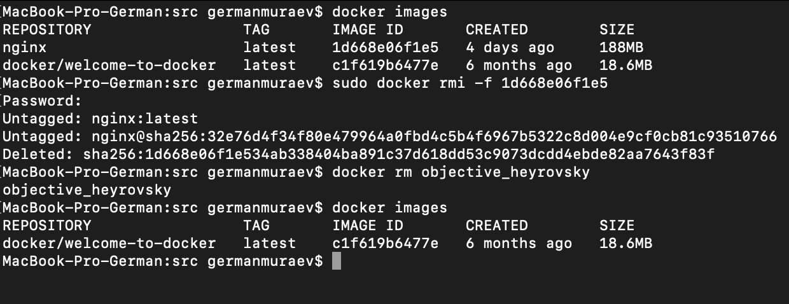  

##### Импорт контейнера обратно через команду *import*.  
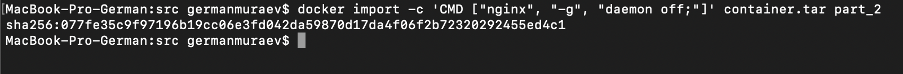  
Команда docker import используется для создания нового образа Docker, импортируя контейнер в виде файла tar или архив. Здесь container.tar является файлом, который содержит файловую систему контейнера.

Флаг -c 'CMD ["nginx", "-g", "daemon off;"]' задает команду (CMD) по умолчанию для контейнера. В данном случае, создаваемый образ будет содержать команду запуска Nginx с параметром -g "daemon off;". Это означает, что при запуске контейнера на основе этого образа, Nginx будет запускаться с указанным параметром.

Таким образом, данная команда создаст новый образ Docker из файла container.tar с указанной командой по умолчанию для запуска Nginx.

##### Запуск импортированного контейнера.  
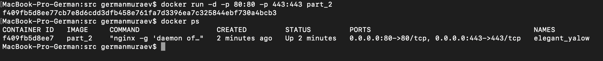  

##### Проверка, что по адресу *localhost:80/status* отдается страничка со статусом сервера **nginx**.  
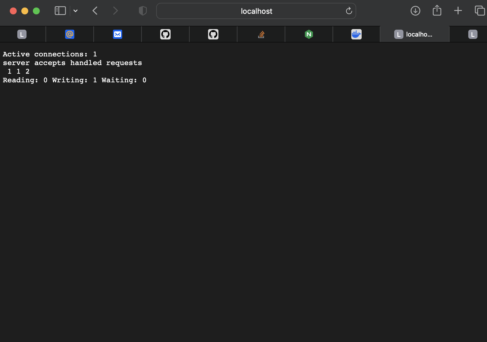  

## Part 3. Мини веб-сервер

##### Мини-сервер на **C** и **FastCgi**, который будет возвращать простейшую страничку с надписью `Hello World!`.
https://lectureswww.readthedocs.io/5.web.server/fcgi.html // лекция по написанию минисервера  
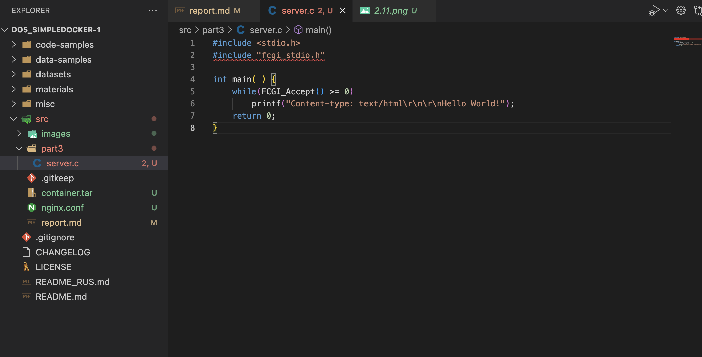  
##### Напиcание своего *nginx.conf*, который будет проксировать все запросы с 81 порта на *127.0.0.1:8080*.  
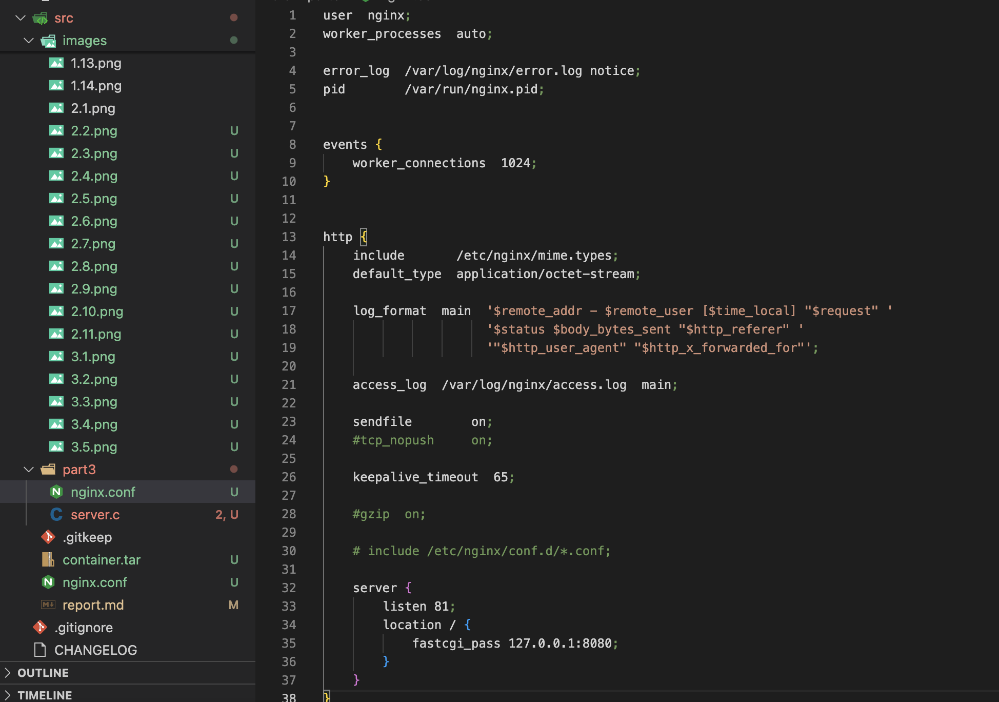  

##### Запуск мини-сервера через *spawn-fcgi* на порту 8080.

##### Копирование файлов в докер:  
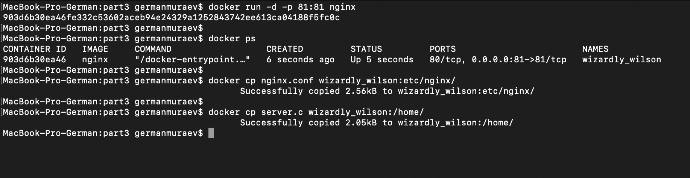  

##### Вход в контейнер, обновление пакетов и устанавливаем gcc, spawn-fcgi и libfcgi-dev:  
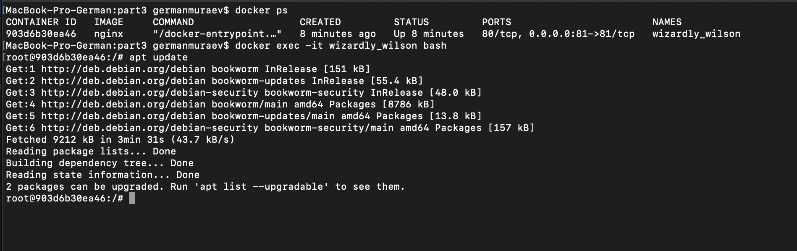  
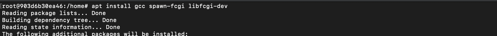

##### Запуск:  
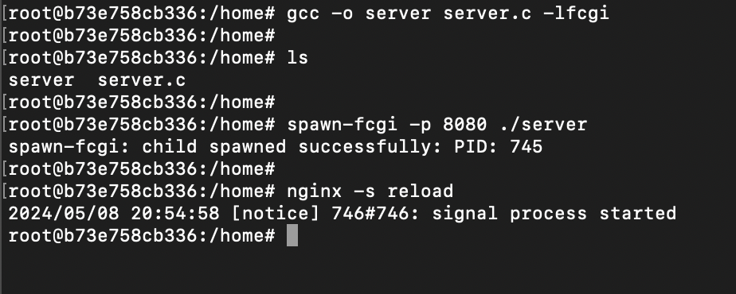  

##### Проверка, что в браузере по *localhost:81* отдается написанная тобой страничка.  
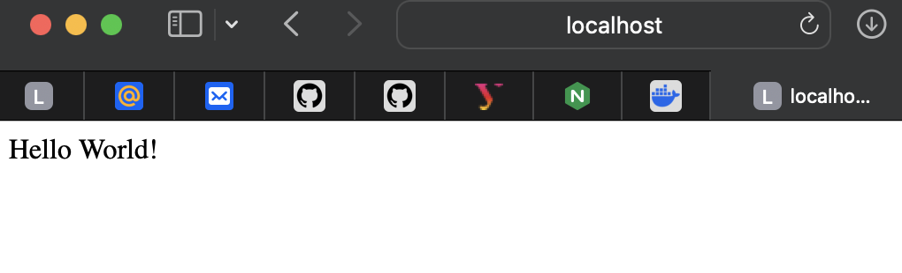  

##### Копирование файла *nginx.conf* по пути *./nginx/nginx.conf*.  
  

## Part 4. Свой докер

#### Докер-образ, который:
##### 1) собирает исходники мини сервера на FastCgi из [Части 3](#part-3-мини-веб-сервер);
##### 2) запускает его на 8080 порту;
##### 3) копирует внутрь образа написанный *./nginx/nginx.conf*;
##### 4) запускает **nginx**.

#####Написание Dockerfile:  
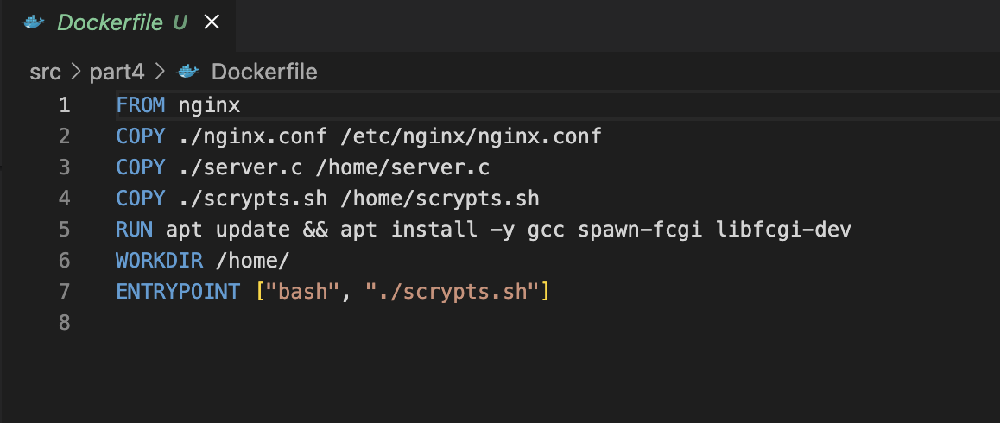  

#####Написание скриптов:  
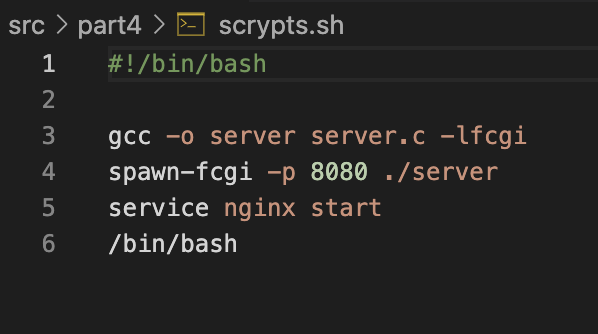  

##### Сборка написанный докер-образ через `docker build` при этом указав имя и тег.  
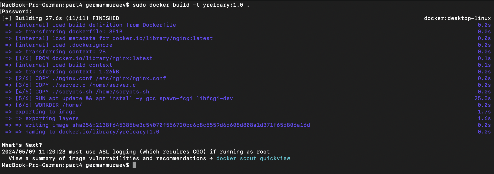  
Флаг -t в команде "Docked Build" указывает на то, что необходимо сначала заново создать образ контейнера перед его запуском.

##### Проверка через `docker images`, что все собралось корректно.  
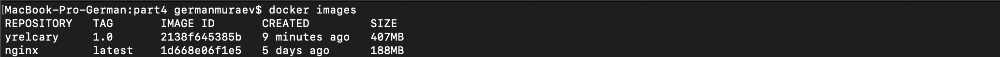  

##### Запуск докер-образа с маппингом 81 порта на 80 на локальной машине и маппингом папки *./nginx* внутрь контейнера по адресу, где лежат конфигурационные файлы **nginx**'а.  
  
оманда docker run используется для запуска контейнера Docker на основе указанного образа. В данном случае, контейнер будет запущен на основе образа yrelcary:1.0 и будет выполнять команду bash в интерактивном режиме.

Флаги и их действия в данной команде:

1. -it: Комбинация двух флагов -i (интерактивный) и -t (терминал) позволяет запустить контейнер в интерактивном режиме с открытым терминалом.
   
2. -p 80:81: Перенаправляет порт 80 из хоста на порт 81 внутри контейнера. Таким образом, все запросы на порт 80 хоста будут перенаправлены на порт 81 контейнера.
   
3. -v /Users/germanmuraev/Desktop/D05_SimpleDocker-1/src/part4/nginx.conf:/etc/nginx/nginx.conf: Создает привязку тома между локальным файлом nginx.conf на рабочем столе и файлом внутри контейнера /etc/nginx/nginx.conf. Это позволяет подключить локальный файл к контейнеру для использования его внутри контейнера.

##### Проверка, что по localhost:80 доступна страничка написанного мини сервера.  
  

##### Проксирование странички */status*, по которой надо отдавать статус сервера **nginx**.  
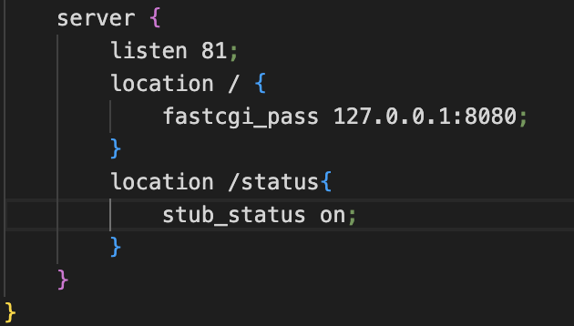  

##### Перезапуск докер-образ.  
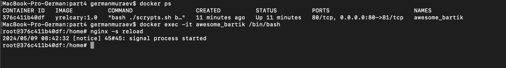  

##### Проверка, что теперь по *localhost:80/status* отдается страничка со статусом **nginx**  
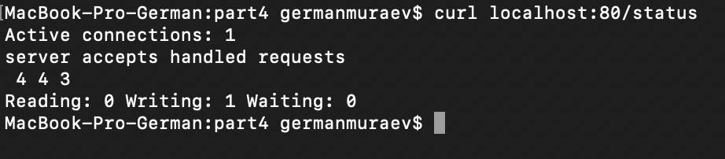  
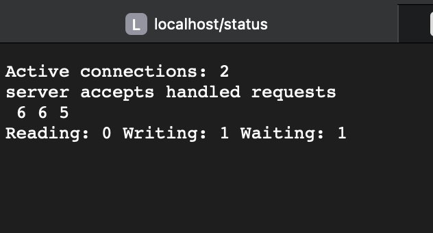  

*Всё сделано верно, поэтому после сохранения файла и перезапуска контейнера, конфигурационный файл внутри докер-образа должен обновиться самостоятельно без лишних действий*

## Part 5. **Dockle**
##### Установка DOckle.  
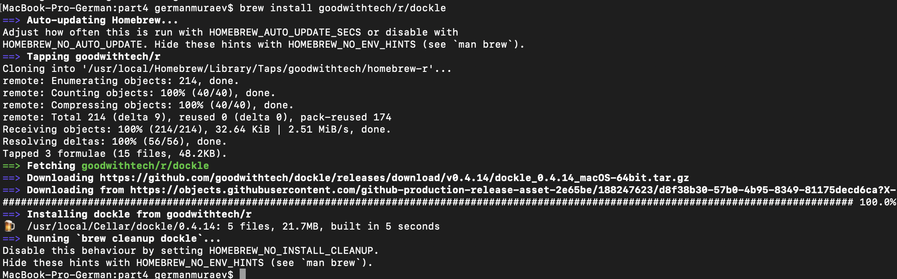  

##### Сканирование образа из предыдущего задания через `dockle [image_id|repository]`.  
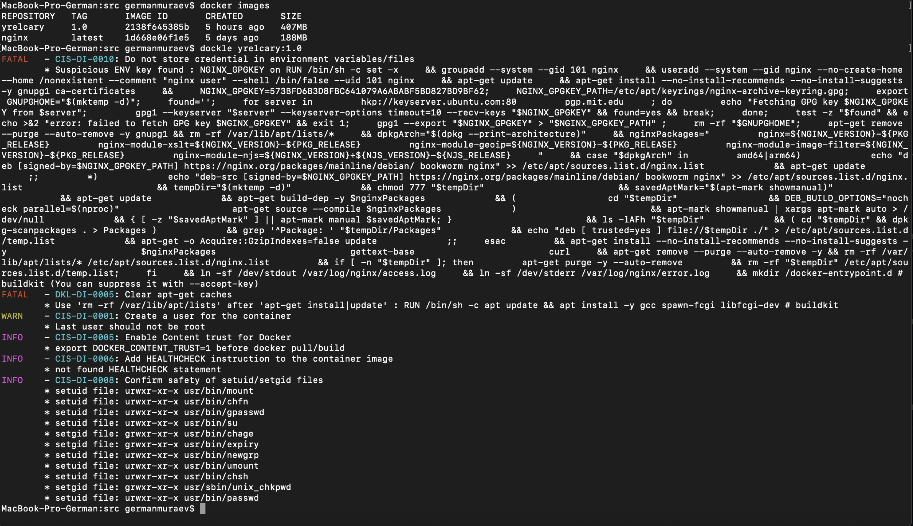  

##### Исправление образа так, чтобы при проверке через **dockle** не было ошибок и предупреждений.  
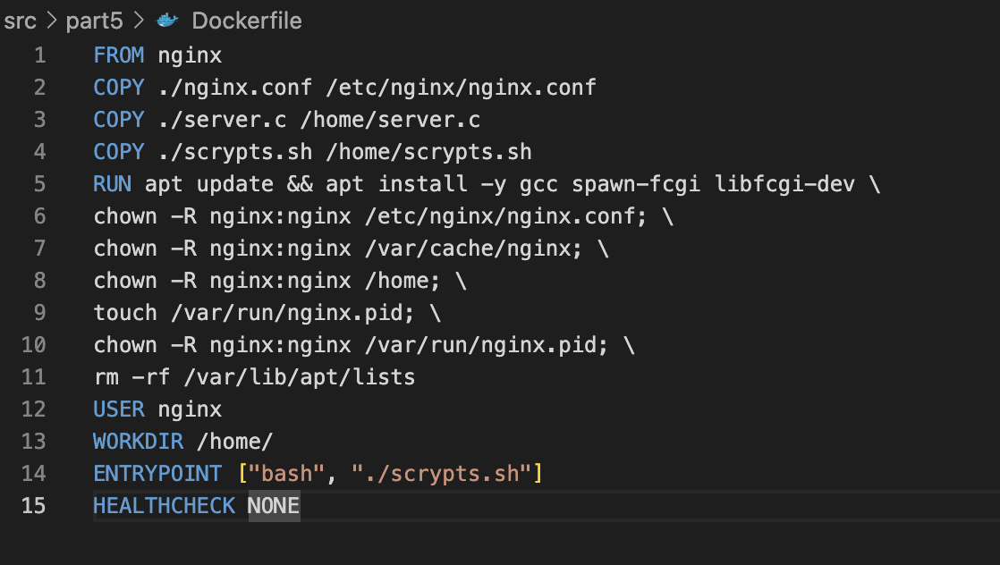  
1) chown -R nginx:nginx /etc/nginx/nginx.conf: изменяет владельца и группу файла nginx.conf на nginx:nginx.
2) chown -R nginx:nginx /var/cache/nginx: изменяет владельца и группу директории /var/cache/nginx на nginx:nginx.
3) chown -R nginx:nginx /home: изменяет владельца и группу директории /home на nginx:nginx.
4) touch /var/run/nginx.pid: создает файл nginx.pid в директории /var/run/.
5) chown -R nginx:nginx /var/run/nginx.pid: изменяет владельца и группу файла nginx.pid на nginx:nginx.
6) rm -rf /var/lib/apt/lists: удаляет директорию /var/lib/apt/lists для очистки кэша пакетов.
7) USER nginx: задает пользователя nginx для выполнения последующих инструкций.
9) Команда HEALTHCHECK NONE в Docker используется для отключения проверки здоровья контейнера. По умолчанию Docker запускает проверку здоровья на основе директивы HEALTHCHECK в Dockerfile, но если эта проверка не требуется, можно использовать указанную команду для отключения ее выполнения.

##### Создаем новый образ.
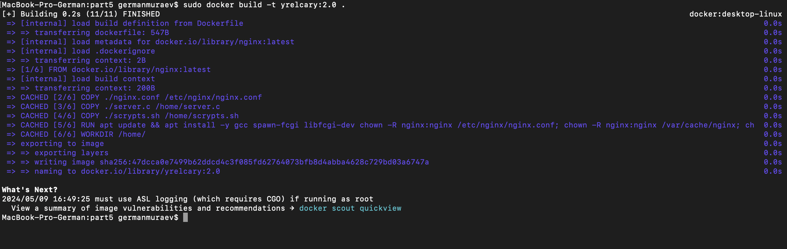  

##### Используем флаг -i CIS-DI-0010, чтобы не показывало первую ошибку, связанную с нарушениями харнения данных.  
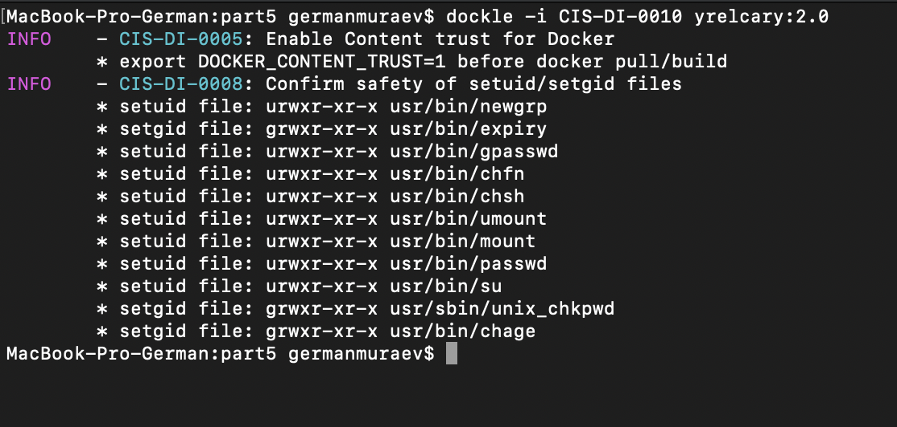
Когда мы используем команду dockle -i CIS-DI-0010, мы указываем утилите Dockle (клеточный сканер для контейнеров) выполнить проверку с определенным идентификатором уязвимости CIS-DI-0010.

Идентификаторы CIS-DI (CIS Docker Image) обычно указывают на конкретные уязвимости или нарушения безопасности в образах Docker, как это определено стандартами безопасности CIS (Center for Internet Security).

## Part 6. Базовый **Docker Compose**

##### Написание файла *docker-compose.yml*, с помощью которого:
##### 1) Поднятие докер-контейнера.
##### 2) Поднятие докер-контейнера с **nginx**, который будет проксировать все запросы с 8080 порта на 81 порт первого контейнера.
##### Мапинг 8080 порта второго контейнера на 80 порт локальной машины.  
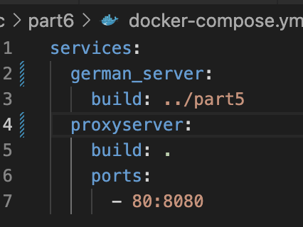  
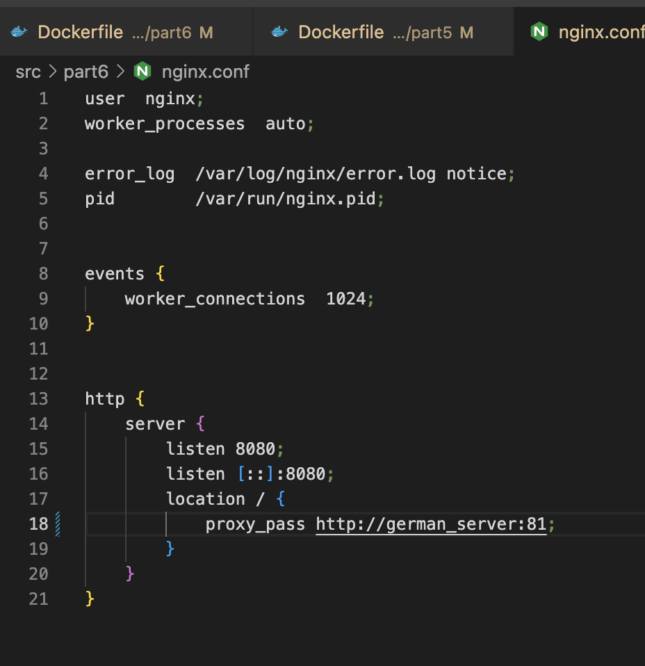  

##### Сборка и запуск проекта с помощью команд `docker-compose build` и `docker-compose up`.  
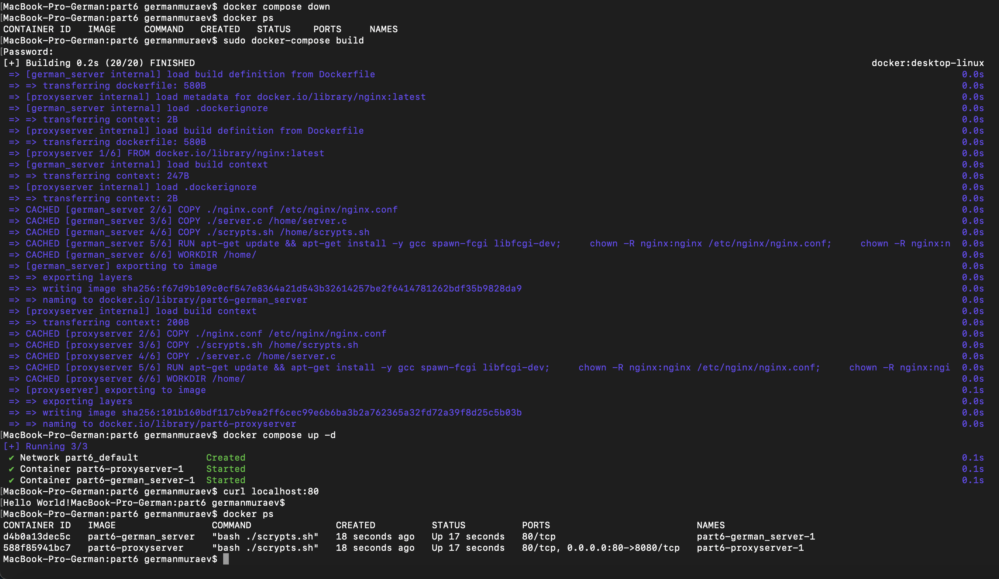  
##### Проверка, что в браузере по *localhost:80* отдается написанная тобой страничка, как и ранее.  
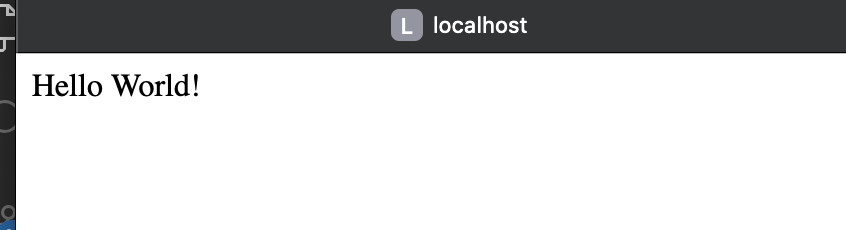  